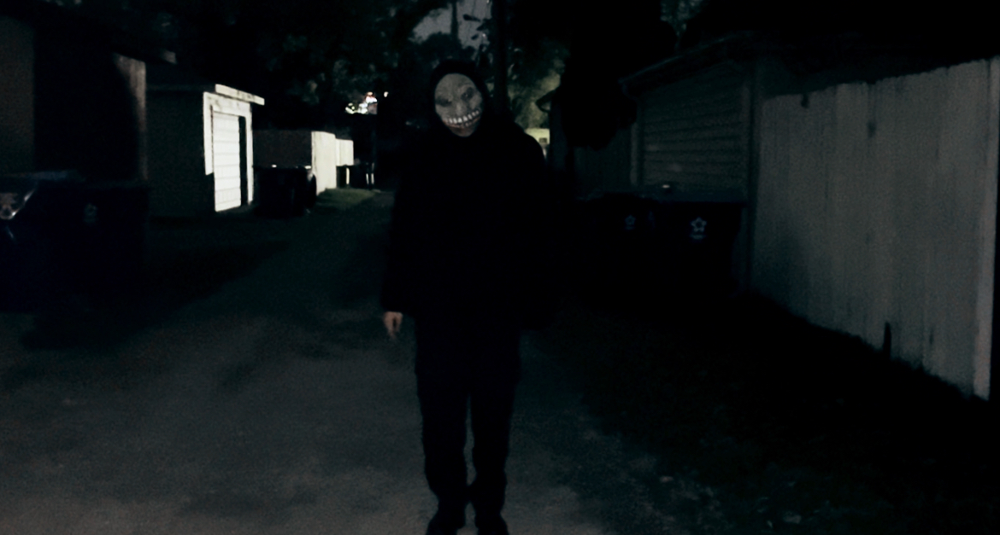

    

---

---

This is the repository for the Hack-O-Ween event held on October 29, 2025; hosted by 
Women in Cyber Security and Capture the Flame. 

It features 6 challenges that were all created by Capture the Flame 
Experience Team Lead Eduardo Murillo. All hosted on the Hack_O_Ween
website.

Hack-O-Ween features 6 total challenges that were made to introduce fundamental cyber security topics and encourage an educational experience while keeping it on theme for Halloween. 

**Ruined_Language**: Cryptography Substitution Cipher  
**LinkedRooms**: Reverse Engineering Pointer Maze  
**Domonic_Themonics**: Web Exploitation featuring faulty javascript  
**Intercepted_Transmission**: Forensics Embedded Morse Code within audio  
**Spooky_Hunt**: OSINT Horror Movie Trivia  
**Found_Footage**: Forensics Metadata manipulation  

Each folder has the challenges as follows with the challenge write ups and the challenge files

<pre> Challenge/ 
        ├── < ChallengeName >.pdf/  
        ├── assets/ 
            ├── toMake/ 
            |   └── <  >
            └── < Challenge File >
</pre>

--- 

 Found Footage Screenshot 

    

**Spooky Hunt Snippet**

